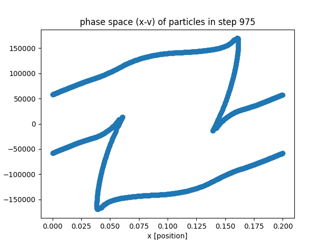

# ESPIC_1D

this is a **1D electrostatc pic** code for simulation of two strsm instablility in periodic conditions in **python**. More situation of plasma simulation can be coded based on this code.
for more information about pic and two stream instability you can see [wiki-pic](https://en.wikipedia.org/wiki/Particle-in-cell), [wiki-2strm](https://en.wikipedia.org/wiki/Two-stream_instability) .

this code inspired from [Birdsall-Book](https://www.taylorfrancis.com/books/mono/10.1201/9781315275048/plasma-physics-via-computer-simulation-langdon-birdsall).

# Requirements and Instalation
you need **numpy, matplotlib and tqdm** .if you haven't them simply install by `pip install numpy matplotlib tqdm`

# Running
for running code, after cloning this repo and cd to parent directory, simply run:
    `python two_stream_instability.py`
also you can change parameters like length, time step, number of steps, plasma frequency, ... in this file and see their effect.
results bu default will saved in ./results directory. 
